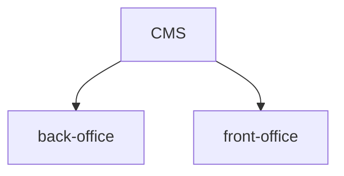
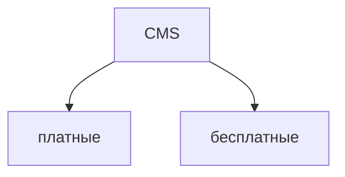

[toc]

# CMS

CMS (система управления контентом) --- компьютерная программа или информационная
система, которая используется для организации процесса по совместному созданию,
управлению, и редактированию содержимого сайта

## Основные функции CMS

- предоставление инструментов для создания содержимого
- организация совестной работы над содержимым
- управление содержимым: хранение, контроль версий, соблюдение режима доступа
- публикация содержимого
- представление информации в виде, удобном для навигации, поиска

## Принцип работы CMS

Редактор **WYSIWYG** --- **W**hat **Y**ou **S**ee **I**s **W**hat **Y**ou
**G**et

Система управления сайтом --- это комплексная программа, позволяющая простому
человеку, не знакомому с программированием, создавать и поддерживать
интернет-проекты любой сложности

CMS обеспечивает пользователя необходимыми визуальными средствами для создания
интерактивных страниц сайта, содержимое которых можно изменять в считанные
секунды, используя встроенный в систему текстовый редактор (WSYIWYG)

Первая CMS --- Vignette (1995)

## Темы, Модули/Расширения/Плагины, Блоки

Шаблон сайта --- пустые заготовки страниц без наполнения их информацией

Принцип работы CMS основан на разделении дизайна сайта и его содержимого

Большинство современных CMS имеют модульную архитектуру, что позволяет
администратору самому выбирать и настраивать те компоненты, которые ему
необходимы (модуль, плагин, компонент)

## Особенности

Сайты, организованные посредством CMS основаны на технологиях:

- веб-сервер
- СУБД (MySQL, PostgreSQL)
- редактор WYSIWYG
- файловый менеджер

## Практическое применение

- блог, форум
- интернет-магазин
- социальные сети
- персональные сайты
- корпоративные сайты
- порталы

## Виды CMS

- WordPress
- Joomla
- Drupal
- MODx
- 1C Bitrix
- _etc..._

## Достоинства

- в работе используется наиболее эффективный инструмент для решения конкретных
  задач
- временные затраты на разработку сайта существенно снижаются
- настраиваемые права для управления контентом

## Недостатки

- меньшая гибкость
- чаще подвергаются атакам
- могут замедлять работу сайтов

## Хостинг. Виды хостинга

Сайты размещаются на сервере, а хостинг служит т.н. проводником между сервером и
интернетом

Хостер --- интернет-компания, которая предоставляет услуги хостинга

## Виды хостинга

По типу предоставляемого ресурса хостинги делятся на:

- виртуальный хостинг --- вид хостинга, при котором много сайтов, размещаются на
  одном сервере; подходит для небольших сайтов
- виртуальный выделенный сервер --- предоставляется место на диске, часть общей
  памяти и процессорное время сервера; выглядит для пользователя так же, как и
  выделенный сервер, но физически на одном реальном сервере располагается
  несколько виртуальных
- выделенный сервер --- предоставляется в пользование сервер целиком; этот вид
  подойдет под тяжелые и большие проекты, или интернет-сервисы
- колокация --- хостинг-провайдер предоставляет место в дата-центре

# Конструктор CMS WordPress

WordPress --- CMS с открытым исходным кодом, написанная на php, СУБД -- MySQL,
сфера применения от блогов до достаточно сложных новостных ресурсов и
интернет-магазинов. Встроенная система плагинов вместе с удачной архитектурой
позволяет создавать проекты с широкой функциональной сложностью

## Архитектура

`ядро + тема + дополнения`

Ядро обеспечивает базовую функциональность. Дополнения представлены плагинами

Настройка и переопределение базовой функциональности ядра и стандартных
компонентов происходит с помощью системы хуков

## Преимущества

- наиболее популярная CMS
- бесплатная
- наиболее широкий набор плагинов, тем, виджетов и т.д.
- WYSIWYG редактор
- технический опыт не обязателен

## Недостатки

- главная проблема --- как использовать все возможности правильно
- возможны проблемы при установке

## Управление и администрирование

- управление пользователями --- WP использует контроль на уровне пользоветелей
  при доступе к различным возможностям
- профили пользователей --- пользователь может настроить свой профиль по желанию
- динамическая генерация страниц --- все страницы генерируются с использованием
  БД и шаблонов каждый раз, когда страница сайта запрашивается браузером
- интернационализация и локализация

## Темы

Шаблон или тема WP отвечает за внешний вид и функциональность ресурса

Тема позволяет изменить визуальное представление сайта без вмешательства в код
ПО. Может включать в себя файлы шаблонов, изображения, CSS, настраиваемые
страницы, а также любые другие файлы с php кодом

Можно управлять отображением содержания путем редактирования шаблонов с помощью
встроенного редактора тем

## Плагины

Плагин является инструментом расширения функциональности WP. Плагины предлагают
пользовательские функции и особенности так, что каждый пользователь может
адаптировать их к своему сайту

Чтобы установить выбранный плагин: `плагины - добавить новый`

Плагины располагаются в `/wp-content/plugins`

После установки плагина необходимо его активировать

С помощью плагинов можно решать следующие задачи:

- обеспечение безопасности сайта
- борьба со спамом
- техническая оптимизация ресурса
- повышение функциональности и юзабилити

## Меры безопасности

- двухфакторная аутентификация
- логины и пароли
- зашифровать все
- обновления CMS

## Особенности кэширования WP

Основные типы кэширования:

- кэширование страниц --- позволяет сохранять страницы целиком в кэш и выдавать
  их из кэша при последующих запросах. В ядре WP кэширование страниц не
  реализовано
- кэширование объектов --- реализовано в самом ядре WP. Реализовано для многих
  объектов в т.ч. опции, записи, метаданные записей, термины и таксономии
- транзитное кэширование --- позволяет сохранять данные на определенный
  промежуток времени. Является постоянным по умолчанию и хранит все данные в БД

# CMS WordPress (работа с контентом)

## Структура БД WordPress

WP использует ряд таблиц БД, связанных между собой, чтобы свести к минимуму
объем данных, который должен быть сохранен

Большинство таблиц связано с одной или несколькими другими таблицами через одно
поле (`id`). Это поле будет уникальным идентификатором для каждой записи

Таблицы БД по умолчанию имеют префикс `wp`

- основная таблица --- `wp_posts`, в ней будет храниться основная часть ваших
  данных
- две таблицы не связаны ни с одной другой: `wp_options` и `wp_links`
- две таблицы для хранения данных о таксономии
- групповая установка сайтов подразумевает некоторые дополнительные таблицы

## Виды контента в WP

4 типа контента:

- сообщения (записи)
- комментарии
- пользователи
- ссылки

### Сообщения

Наиболее важный тип контента в WP. Существует 5 типов записей по умолчанию,
встроенных в WP:

- записи (posts) --- по умолчанию выводятся на главных страницах многих тем по
  убыванию. Шаблоном страницы записи является файл темы single.php
- страницы (pages) --- могут использовать произвольный файл из папки с темой в
  качестве своего шаблона. Можно использовать шаблоны страниц для любого типа
  поста. Имеют иерархию. Имеется возможность сортировки по порядку. В качестве
  шаблона страницы может быть задействован один из следующих файлов:
  - {ваш_шаблон}.php
  - page-{ярлык_страницы}.php
  - page.php
  - singular.php
  - index.php
- вложения (attachments) --- тип поста, предназначенный для управления файлами,
  загруженными через стандартный WP загрузчик, а также для хранения информации о
  нем
- редакции (revisions) --- черновики записей
- элементы меню навигации (navigation menu items) --- данный тип постов хранит
  информацию об элементах навигации. Это единственный тип, который не
  используется для работы с контентом сайта. Элементы меню навигации сохраняются
  как записи, а затем выводятся с помощью запроса при отображении меню

### Комментарии

Комментарии хранятся в отдельной таблице БД --- `wp_comments`

### Пользователи

Пользователи имеют свои собственные таблицы `wp_users`, а также метаданные,
которые хранятся в таблице `wp_usermeta`

### Ссылки

Устаревший тип контента

### Замечание по поводу метаданных

Среди четырех типов контента, три могут содержать прикрепленные метаданные:

- записи
- комментарии
- пользователи

## Виджеты

Виджеты --- независимые блоки содержимого, которые можно размещать в областях,
предусмотренных темой

WP виджеты бывают типовые. Могут создаваться плагинами и темами, а могут быть
определены прямо в админке, с помощью `html`-кода

Роль регионов в WP играют сайдбары. Их нужно регистрировать в теме, в файле
`functions.php`. Для сайдбара по умолчанию есть шаблон `sidebar.php`. Можно
определять шаблон `sidebar-name.php`

## Создание страниц

По умолчанию на блоге уже создана одна рубрика --- `uncategorized`, ее удалить
нельзя

## Создание меню
